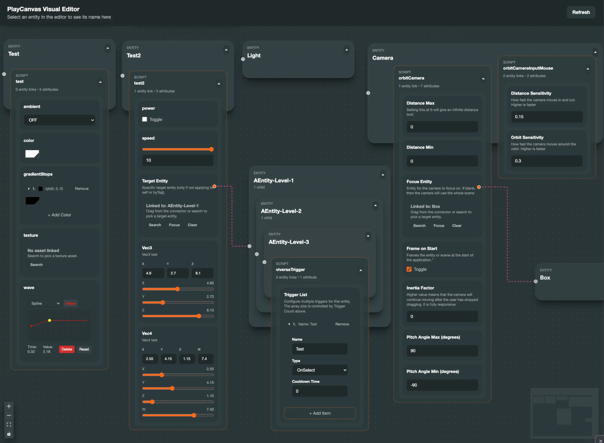

<div align="center">
  
  <h1>PlayCanvas Visual Graph Editor</h1>
</div>


A Chrome Extension for PlayCanvas that transforms scene management with a visual node graph and advanced attribute editors.


## Features

- **Visual Scene Graph**: Interactive node-based view of your Entity hierarchy with drag-and-drop support.
- **Context Menu Actions**: Right-click to quickly create new Entity at the root or as children of existing nodes.
- **Advanced Attribute Editors**:
  - **Optimized Array Input**: Enhanced UI Component for handling array data structures.
  - **Visual Selectors**: Connection lines for Entity and Asset references to visualize data flow.
- **Bi-directional Sync**: Real-time synchronization with PlayCanvas Editor.
- **Live Updates**: Instantly reflects selection, property changes, and structural updates.



## Installation

1.  **Clone the repository**

    ```bash
    git clone https://github.com/rhanlin/playcanvas-graph-editor.git
    cd playcanvas-graph-editor
    ```

2.  **Install dependencies**

    ```bash
    pnpm install
    ```

3.  **Build the extension**

    ```bash
    pnpm build
    ```

4.  **Load into Chrome**
    - Open `chrome://extensions/`
    - Enable "Developer mode".
    - Click "Load unpacked" and select the `dist` folder.

## Usage

1.  **Install the Extension**:

    - Download the latest release (`PlayCanvas-Graph-Editor.zip`) from the [Releases page](https://github.com/rhanlin/playcanvas-graph-editor/releases).
    - Unzip the file.
    - Open `chrome://extensions/` in Chrome.
    - Enable "Developer mode".
    - Click "Load unpacked" and select the unzipped folder.

2.  **Open PlayCanvas Editor**:

    - Navigate to your PlayCanvas project editor.

3.  **Launch Graph Editor**:
    - Click **"PlayCanvas Graphics Editor"** through the browser extension will automatically open a tab.
    - Enjoy the features.

## Tech Stack

- **Core**: React 18, TypeScript, Vite
- **Graph**: React Flow
- **State**: Zustand
- **Styling**: Tailwind CSS, @playcanvas/pcui

## Contributing

Contributions are welcome! Please see [CONTRIBUTING.md](CONTRIBUTING.md) for details.

## License

MIT License - see [LICENSE](LICENSE) for details.
